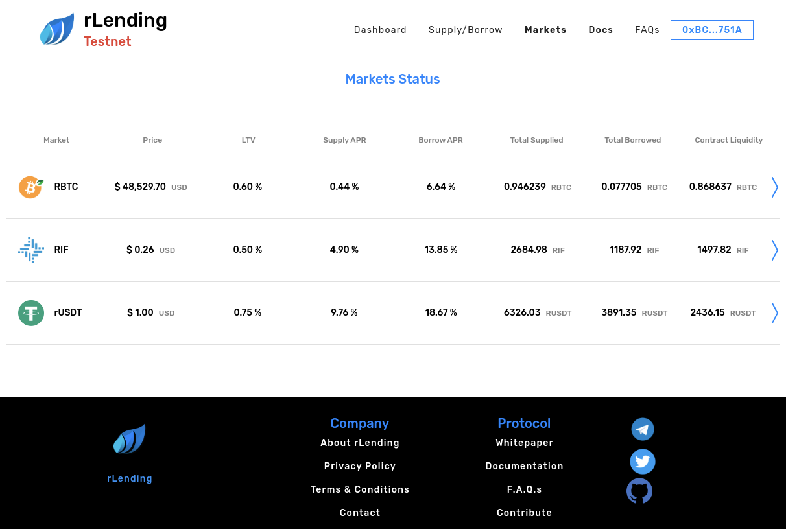

# rLending-ui

**rLending** is a decentralized investment and finance (DEFI) platform that allows users to invest in a safe way.

This repository holds the open source for the public [rLending web application](https://test.rlending.app).

The [rLending-protocol](https://github.com/riflending/rlending-protocol) is based upon our own core of Smart Contracts which form an algorithmic distributed protocol deployed on the RSK network. This protocol defines pools of assets with algorithmically derived interest rates, based on the supply and demand for the assets. Suppliers (and borrowers) of an asset interact directly with the protocol, earning (and paying) a floating interest rate, without having to negotiate terms such as maturity, interest rate or collateral with a peer or counterparty.

Through the use of this web application, Lenders earn revenue in exchange for their supplied assets and borrowers pay interests for the assets they used.

|  |  |
| --- | --- |
|  |  |

# How to (developers)
## Requirements:
 * yarn ^v1.22
 * node 12.x
 * a deployed [rLending-protocol](https://github.com/riflending/rlending-protocol)
 * Metamask or Nifty wallet to access your account

## Usage
1. Clone the repository to your localhost
2. cd into the cloned repository
3. Run: ```yarn install```, this will take care of all dependencies.
4. Run: ```yarn serve```, this will launch the server.
5. Point your browser towards [https://localhost:8080/](https://localhost:8080/)

## Notes
* If you are here looking for the `middleware` layer described in [The Whitepaper](https://github.com/riflending/rlending-protocol/blob/master/whitepaper/rLending-Whitepaper-v1.0.pdf), you will find it [here](src/middleware)
* If you get erros related to dependencies, run: ```yarn install --check-files```